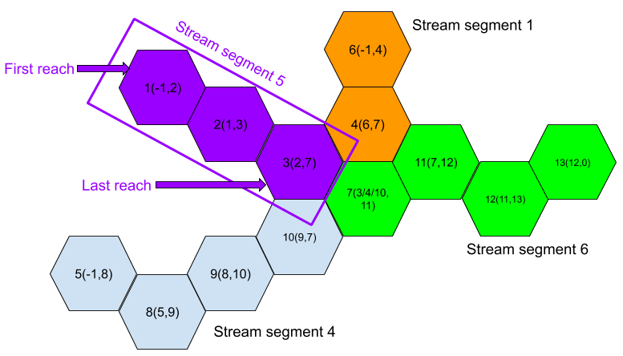

## `HexWatershed: A hexagon mesh grid based watershed delineation model`

   

`HexWatershed` is a hydrologic routing model based on the hexagon mesh framework.

This package provides a <a href="http://www.python.org">`Python`</a> based scripting interface to the underlying `HexWatershed` model, including a range of additional facilities for file I/O, visualisation and pre/post-processing operations.

`HexWatershed` has been compiled and tested on various `64-bit` `Linux` and `Mac` based platforms. 

### `Quickstart`

    Ensure you have a c++ compiler and the cmake utility installed.
    Clone/download + unpack this repository.
    python3 setup.py build_external
    python3 setup.py install
    python3 example.py --IDnumber=0
    
Note: installation of `HexWatershed` requires a `c++` compiler and the `cmake` utility. Besides, the `GDAL` is required to build the model.
    
### `Function Listing`

See `HexWatershed` for a description of the various functions available.

    setup.py    - compile and install HexWatershed's c++ backend using cmake.
    

### `Example Problems`

Run `python3 example.py --IDnumber=N` to call the `N-th` example. `*.vtk` output is saved to `../cache` and can be visualised with, for example, <a href=https://www.paraview.org/>Paraview</a>.

### `License`

This program may be freely redistributed under the condition that the copyright notices (including this entire header) are not removed, and no compensation is received through use of the software.  Private, research, and institutional use is free.  You may distribute modified versions of this code `UNDER THE CONDITION THAT THIS CODE AND ANY MODIFICATIONS MADE TO IT IN THE SAME FILE REMAIN UNDER COPYRIGHT OF THE ORIGINAL AUTHOR, BOTH SOURCE AND OBJECT CODE ARE MADE FREELY AVAILABLE WITHOUT CHARGE, AND CLEAR NOTICE IS GIVEN OF THE MODIFICATIONS`. Distribution of this code as part of a commercial system is permissible `ONLY BY DIRECT ARRANGEMENT WITH THE AUTHOR`. (If you are not directly supplying this code to a customer, and you are instead telling them how they can obtain it for free, then you are not required to make any arrangement with me.) 

### `References`

There are a number of publications that describe the algorithms used in `HexWatershed` in detail. If you make use of `HexWatershed` in your work, please consider including a reference to the following:

Liao, C., Tesfa, T., Duan, Z., & Leung, L. R. (2020). Watershed delineation on a hexagonal mesh grid. Environmental Modelling & Software, 128, 104702. https://doi.org/10.1016/j.envsoft.2020.104702

